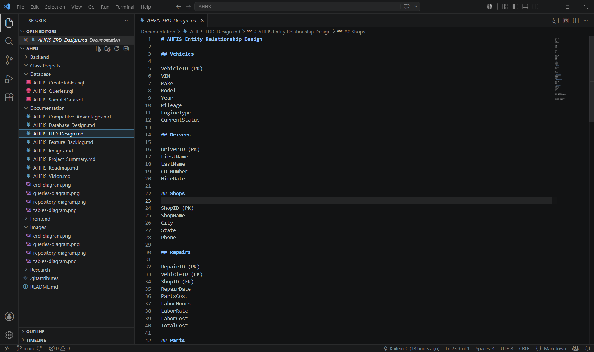

# AHFIS Fleet Maintenance Database

## Overview

The AHFIS Fleet Maintenance Database is a relational database project designed to support fleet maintenance tracking, vehicle diagnostics, repair history management, and maintenance analytics.

This project serves as the foundational database layer for the future AHFIS (Ascending Horizon Fleet Intelligence System), a transportation intelligence platform being developed to help drivers, fleet managers, and transportation companies improve maintenance planning, reduce downtime, and make data-driven operational decisions.

---

## Business Problem

Fleet maintenance data is often scattered across spreadsheets, invoices, repair shops, and maintenance records.

This project centralizes maintenance information into a structured relational database that allows users to:

- Track vehicle maintenance history
- Monitor diagnostic events
- Analyze repair costs
- Identify recurring issues
- Monitor downtime
- Support future predictive maintenance models

---

## Technologies Used

- SQL
- Relational Database Design
- Entity Relationship Modeling
- Database Normalization
- Data Analytics
- GitHub

---

## Database Structure

The database includes the following entities:

- Vehicles
- Drivers
- Shops
- Vendors
- Maintenance Events
- Diagnostic Events
- Repair Parts
- Labor Records
- Vehicle Status

Relationships are designed to support maintenance tracking and future analytical reporting.

---

## Database Design

### Entity Relationship Diagram



---

## Sample Data

The database includes realistic fleet maintenance records including:

- Vehicle information
- Maintenance events
- Diagnostic codes
- Parts usage
- Labor tracking
- Repair costs

---

## Example Queries

The project includes analytical SQL queries such as:

### Total Repair Cost by Vehicle

```sql
SELECT ...